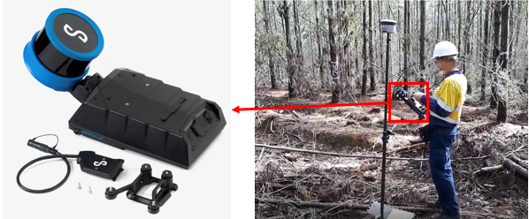
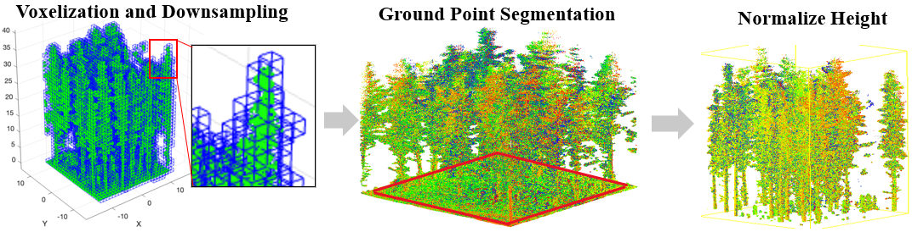
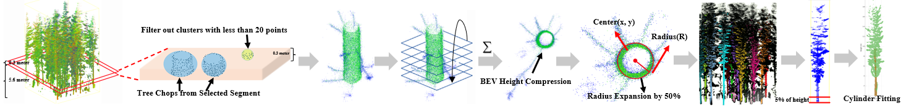
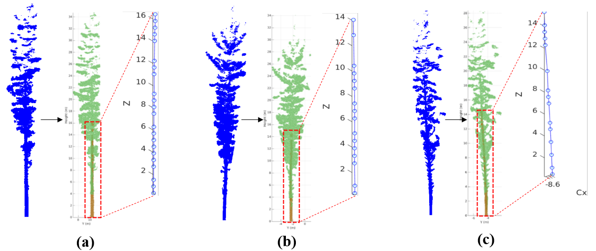

# Geometric Signal Processing for 3D Forest Point Clouds: Handheld SLAM–LiDAR Stem Modeling

> **Notice:** Our ICASSP manuscript is under review. We have released the full processing pipeline: terrain normalization, stem seeding, BEV cross-section fitting, piecewise cylindrical modeling, and feature extraction. We warmly invite reviewers and researchers to try the code, reproduce our metrics, and share feedback. The Western Australia *Pinus radiata* dataset (plots, annotations, splits) will be made publicly available upon publication.  

---

## Table of Contents
- [1. Introduction](#1-introduction)
- [2. Motivation and Background](#2-motivation-and-background)
- [3. System Overview](#3-system-overview)
- [4. Study Sites & Data Acquisition](#4-study-sites--data-acquisition)
- [5. Methodology](#5-methodology)
- [6. Experimental Design](#6-experimental-design)
- [7. Results and Performance](#7-results-and-performance)
  - [7.1 Representative Plot Statistics](#71-representative-plot-statistics)
  - [7.2 Accuracy & Robustness](#72-accuracy--robustness)
  - [7.3 Comparison with State-of-the-Art](#73-comparison-with-state-of-the-art)
- [8. Limitations & Future Work](#8-limitations--future-work)
- [9. Main Contributors](#9-main-contributors)
- [10. How to Cite](#10-how-to-cite)

---

## 1. Introduction

Reliable **stem measurements**—DBH, total height, stem length, taper curve, and axis lean/curvature—are key to forest inventory, growth modeling, and value recovery. Aerial and conventional terrestrial sensing often miss **near-ground geometry** in dense plantations due to occlusion, motion distortion, and terrain bias.

This repository implements a **handheld SLAM–LiDAR** pipeline that delivers **TLS-like DBH accuracy** with the mobility needed for plot-scale surveys. The system performs **convex terrain normalization (Huber + TV)**, **density-regularized stem seeding**, **constrained BEV algebraic circle fitting**, and **taper-aware piecewise cylindrical growth under a robust inlier–outlier likelihood** to reconstruct per-tree geometry end-to-end.

---

## 2. Motivation and Background

- **Inventory-critical variables**: DBH at 1.3 m, total height, taper \(r(z)\), stem length, lean & curvature.  
- **Why handheld SLAM–LiDAR?** Offers speed and coverage in dense stands where TLS is logistically heavy and UAV lacks basal cross-section fidelity.  
- **Key challenge**: Near-ground occlusions and terrain bias corrupt cross-section fitting and axis tracking.  
- **Our answer**: A geometry-aware, robust pipeline in terrain-normalized coordinates to stabilize cross-sections and stem growth across cluttered plots.

---

## 3. System Overview

The pipeline outputs **per-tree**:
- **DBH**, **total height**, **stem length**
- **Taper curve** \(r(z)\) (and optional smoothed \(\hat r(z)\))
- **Axis lean** (magnitude/azimuth) and **curvature** profile

Core building blocks:
1. **Voxel aggregation** (reduce anisotropy, keep stem detail)  
2. **Convex terrain fitting** with **Huber/TV** → **height normalization**  
3. **Density-regularized seeding** in a thin height band  
4. **BEV constrained algebraic circle fitting** (Taubin-style)  
5. **Piecewise cylindrical modeling** with **MLESAC** + **one-sided taper penalty**

---

## 4. Study Sites & Data Acquisition

We surveyed **40 fixed-area plots** in *Pinus radiata* plantations (Western Australia), spanning four age classes. A **Hovermap-class VLP-16** handheld unit was walked in concentric paths with loop closure; differential GNSS located plot centers. Near stems, point density exceeded \(5 \times 10^4\) pts/m\(^2\). Ground-truth includes **DBH & height** for all trees; **3 plots** underwent **destructive sampling** for section diameters/lengths, enabling full taper/flexure validation.

  

### Representative Plot Statistics

| Plot ID | Trees | Age (yr) | DBH Range (mm) | DBH Mean (mm) | Height Range (m) | Height Mean (m) | Points (M) | Density (pts/m²) | Scan Time (min) |
|---------|-------|----------|----------------|---------------|------------------|-----------------|------------|------------------|-----------------|
| 25      | 15    | 34       | 315–535        | 417.5         | 29.0–43.1        | 36.5            | 28.6       | 42,950           | 7               |
| 31      | 24    | 18       | 160–310        | 243.8         | 10.5–26.9        | 23.1            | 49.9       | 74,860           | 8               |
| 42      | 50    | 8        | 65–205         | 137.6         | 9.8–16.2         | 14.0            | 40.2       | 58,120           | 10              |

The three plots capture distinct forest conditions. Plot 25 represents an older stand with fewer but much larger trees (mean DBH ≈ 42 cm, mean height ≈ 36.5 m). Plot 31 shows a mid-aged stand with medium-sized stems (mean DBH ≈ 24 cm, height ≈ 23 m). Plot 42 is the youngest and densest, with many small trees (mean DBH ≈ 14 cm, height ≈ 14 m). This gradient demonstrates that the dataset covers a wide range of ages, densities, and structural complexity, ensuring robust evaluation across different plantation stages.

---

## 5. Methodology

### Signal Preprocessing

Raw point clouds are downsampled by **2 cm voxel aggregation**. Ground elevation is estimated on a **0.25 m grid** using a convex fit with **Huber fidelity (δ = 0.15 m)** and **second–order TV regularization (β = 0.8)**. Heights are normalized as \(\tilde z = z - g(x,y)\), making vertical measurements terrain-invariant but reversible to world space.  

### Stem Extraction

Tree seeds are detected in a **0.8–2.0 m band** via **density-regularized clustering**. Around each seed, a **Taubin-style algebraic circle** is fitted in bird’s-eye view to initialize stem cross-sections. Stems are then reconstructed slab by slab (**0.5 m height, 50% overlap**) using **MLESAC inlier–outlier likelihood** (π = 0.6, σ = 0.02 m, Dmax = 0.25 m). A **one-sided taper penalty (ε = 0.005 m)** rejects non-physical radius increases, ensuring stable taper curves.  

### Feature Computation
From the reconstructed axes and radii, the pipeline derives:  
- **DBH** at 1.3 m  
- **Tree height** as maximum normalized elevation  
- **Stem length** as axis arc length  
- **Taper curves** (piecewise radii, with optional spline smoothing)  
- **Axis lean** from least-squares fitting  
- **Curvature** from tangent deviations  

These features provide both standard inventory variables and detailed stem geometry descriptors.  

---

## 6. Experimental Design

- **Complexity levels**: Low, Medium, High (based on density, canopy closure, understory clutter)  
- **Metrics**: RMSE, rRMSE, MAE (DBH/Height/Stem length), flexure angles  
- Dataset includes **per-tree annotations**, **benchmark splits**, and **reconstructed outputs**

---

## 7. Results and Performance

### 7.2 Accuracy & Robustness

| Complexity Level | DBH (cm, gt/est; error) | Height (m, gt/est; error) | Stem Length (m, gt/est; error) | Flexure (°) max(θx/θy) |
|------------------|--------------------------|----------------------------|--------------------------------|-------------------------|
| Low              | 31.7 / 30.9 (0.8)       | 30.4 / 30.9 (0.5)          | 30.4 / 30.1 (0.3)              | 3.5 / 2.2              |
| Medium           | 30.3 / 31.4 (1.1)       | 26.1 / 26.8 (0.7)          | 26.9 / 26.2 (0.7)              | 3.6 / 2.3              |
| High             | 14.6 / 15.8 (1.2)       | 14.3 / 15.3 (1.0)          | 14.7 / 14.1 (0.6)              | 2.6 / 3.3              |
| **Avg (MAE)**    | **-- (1.0)**            | **-- (0.7)**               | **-- (0.5)**                   | --                      |
| **Avg (RMSE/rRMSE)** | **1.15 / 4.20%**    | **0.50 / 3.90%**           | --                             | --                      |

Across all stand complexity levels, the pipeline maintains centimeter-level DBH accuracy with an overall mean absolute error (MAE) of 1.0 cm and sub-meter height accuracy with MAE of 0.7 m. Stem length errors average 0.5 m, confirming stable estimation even in dense stands. The overall RMSE values are 1.15 cm (4.20% rRMSE) for DBH and 0.50 m (3.90% rRMSE) for height, comparable to TLS benchmarks. While flexure angles increase in high-density plots, they remain within biologically plausible ranges. These averages demonstrate that the pipeline achieves consistent, inventory-grade accuracy across varying forest conditions.

---

### 7.3 Comparison with State-of-the-Art

#### DBH Accuracy

| Study              | Platform | Species/Stand               | DBH RMSE / rRMSE |
|---------------------|----------|-----------------------------|------------------|
| Liu et al. (2018)   | TLS      | *Pinus yunnanensis*         | 1.17 / --        |
| Liu et al. (2018)   | TLS      | *Pinus densata*             | 1.28 / --        |
| Liu et al. (2018)   | TLS      | *Quercus semecarpifolia*    | 1.22 / 4.97%     |
| Feng et al. (2022)  | ULS      | Poplar (plant.)             | 2.10 / 12.44%    |
| Zhang et al. (2023) | ALS      | Chinese fir                 | 1.71 / 12.91%    |
| Gollob et al. (2021)| sLiDAR   | Mixed urban                 | 1.50 / 8.6%      |
| **Ours (2026)**     | HMLS     | *Pinus radiata*             | **1.15 / 4.20%** |

The comparison shows that our handheld MLS (HMLS) system achieves 1.15 cm RMSE and 4.20% rRMSE for DBH, essentially matching the precision of TLS studies (≈1.2 cm RMSE) while being far more mobile and practical in dense stands. In contrast, aerial and UAV-based approaches typically report larger errors (≥1.7 cm, often >10% rRMSE), reflecting their weaker sensitivity to basal cross-sections. Smartphone LiDAR achieves competitive results in urban settings (≈1.5 cm), but lacks scalability in forests. Overall, the average performance of our method places it at the TLS benchmark level, while maintaining operational efficiency for large-scale forest inventory.

#### Height Accuracy

| Study              | Platform | Species/Stand               | Height RMSE / rRMSE |
|---------------------|----------|-----------------------------|---------------------|
| Liu et al. (2018)   | TLS      | *Pinus yunnanensis*         | 0.54 / --           |
| Liu et al. (2018)   | TLS      | *Pinus densata*             | 0.57 / 6.17%        |
| Corte et al. (2020) | ULS      | *Eucalyptus benthamii*      | 1.51 / 7.91%        |
| Ganz et al. (2019)  | ULS      | Douglas-fir stand           | 0.76 / --           |
| Ganz et al. (2019)  | ALS      | Mixed conifer               | 1.20 / --           |
| **Ours (2026)**     | HMLS     | *Pinus radiata*             | **0.50 / 3.90%**    |

Compared with existing TLS, ALS, and UAV-LS studies, our handheld MLS (HMLS) system attains TLS-like DBH accuracy (1.15 cm RMSE) while operating with much greater mobility. For height, our method achieves 0.50 m RMSE (3.9% rRMSE), outperforming most aerial platforms and approaching TLS precision. These results highlight that the proposed pipeline balances high accuracy with operational efficiency, making it well suited for rapid plot-scale forest surveys.

---

## 8. Limitations & Future Work

- Ground fit errors can propagate; butt swell/occlusion can bias basal slabs.  
- Dense stands may still trigger seeding failures; SLAM drift can induce axis waviness.  
- Generalization beyond species/sensors in the current dataset is pending.  

**Future work**: joint ground–stem optimization, species-aware taper priors, multi-session fusion with uncertainty, semantic branch suppression, adaptive scanning trajectories, broader cross-site validation.

---

## 9. Main Contributors

This work was conducted by a cross-disciplinary team at **The University of Western Australia (UWA)** with collaborators.

- **Haitian Wang*** – Co-first author; pipeline design & implementation, experiments, analysis, writing.  
- **Yiren Wang*** – Co-first author; modeling & geometry processing, evaluation.  
- **Yihao Ding†** – Senior supervision, problem framing, manuscript.  

\*Equal contribution.  †Corresponding author.

---

> Contact: haitian.wang@uwa.edu.au  
> Project by: Department of Computer Science and Software Engineering, University of Western Australia, Australia.
